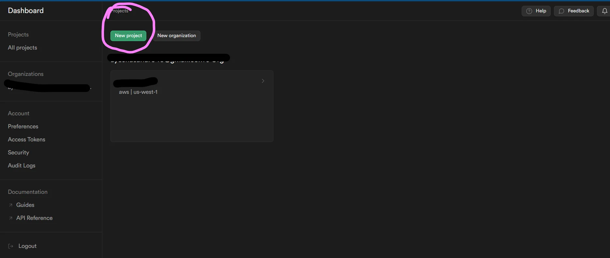
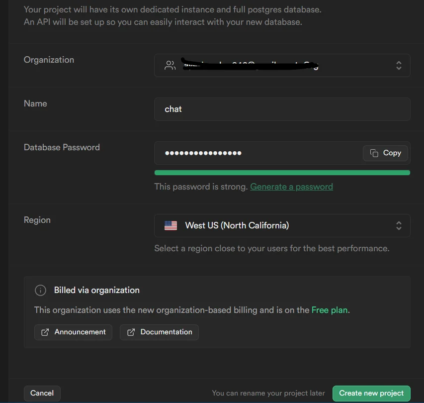
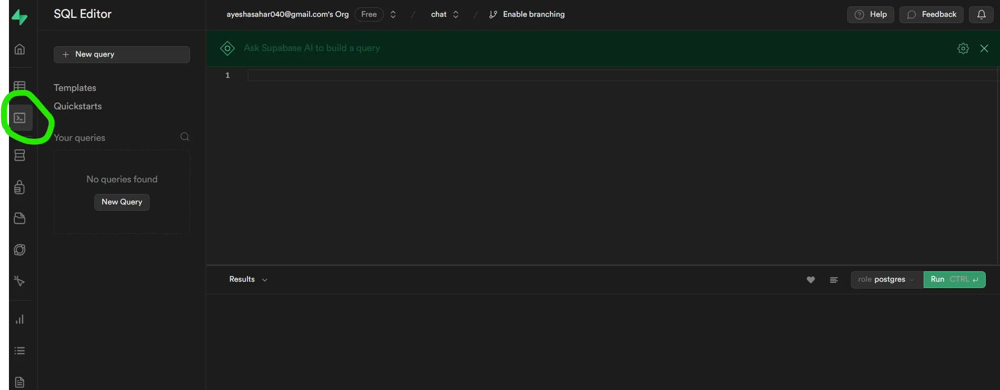
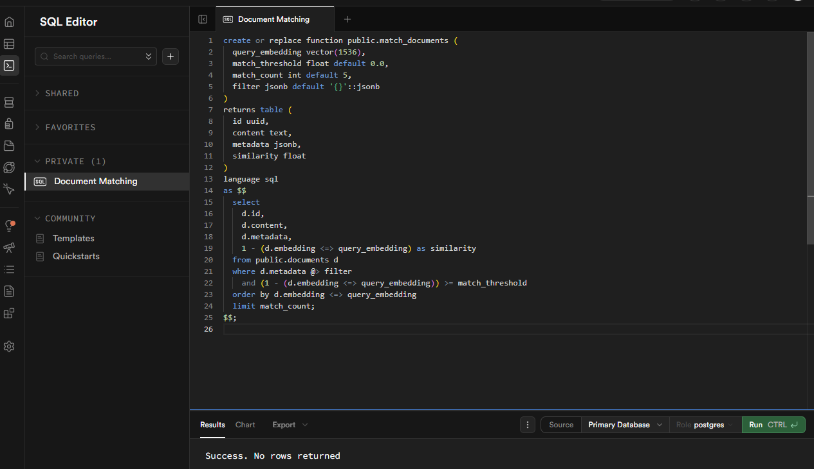
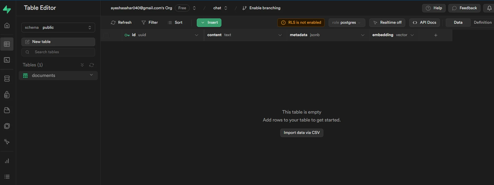

# Simple RAG Chatbot using Supabase and FastAPI

## Github setup

First, make sure SSH token for Github access has been properly configured. If using WSL, this should be done such that identity verification is conducted during startup.

1. Generate an SSH key (if you don’t already have one)

```bash
ssh-keygen -t ed25519 -C "your_email@example.com"
```

Press enter through the defaults

2. Start the SSH agent and add your key:

```bash
eval "$(ssh-agent -s)"
ssh-add ~/.ssh/id_ed25519
```

3. Copy your public key:

```bash
cat ~/.ssh/id_ed25519.pub
```

4. Go to GitHub → Settings → SSH and GPG keys → New SSH key

```bash
Title: “My PC”
```

Paste your public key and save

Then, create a new Github repo. Call it <test-app-name>

Make sure to change repo remote to use SSH inside the terminal:

```bash
git remote set-url origin git@github.com:<github-username>/<test-app-name>.git
```

Next, if already have an existing repository, use command line to push it (zipengsg is mine)

```bash
git remote add origin git@github.com:zipengsg/<test-app-name>.git
git branch -M main
git push -u origin main
```

Otherwise, create a new repository; make sure to create separate directory folder for it first.

```bash
git init
echo "# <test-app-name>" >> README.md
git add README.md
git commit -m "first commit"
git branch -M main
git remote add origin git@github.com:zipengsg/<test-app-name>.git
git push -u origin main
```

Can create a new repo first, then use VSCode to get into WSL and get into the project folder.

## Set up Supabase

Courtesy to: https://ayeshasahar.hashnode.dev/creating-a-rag-chatbot-with-supabase-openai-python-langchain?source=more_series_bottom_blogs

### Project Creation

Login or create your Supabase account. Then click on New Project. Note that the actual UI may look a bit different due to platform updates:



Then setup your project. Copy your database password as you might need it in the future and just choose the region closest to you. Then click on "Create new project".



You will then see this screen after a few seconds (important API key and database URL information):


From above, copy the anon key and the project URL as we'll set them up in our .env file later. 

### Create Documents Table

Before working on our main code, we need a table where we can upload our data in the form of embeddings. For now, we'll store only the extracted document chunks. We may store original document later in a dedicated storage.

Open the project you created and select "SQL Editor":



We'll start by enabling vector extension:

```postgresql
create extension if not exists vector;
```

Then we will create a table to store our document chunks. This can be done either via UI inside Supabase or through SQL code. We'll use SQL for now:

```postgresql
create table
  chunks (
    id uuid primary key,
    content text,
    metadata jsonb,
    embedding vector (1536)
  );
```

For searching through our created knowledge base, we're going to need a function (note that this is different from the original blog):

```postgresql
create or replace function public.match_chunks (
  query_embedding vector(1536),
  match_threshold float default 0.0,
  match_count int default 5,
  filter jsonb default '{}'::jsonb
)
returns table (
  id uuid,
  content text,
  metadata jsonb,
  similarity float
)
language sql
as $$
  select
    c.id,
    c.content,
    c.metadata,
    1 - (c.embedding <=> query_embedding) as similarity
  from public.chunks c
  where c.metadata @> filter
    and (1 - (c.embedding <=> query_embedding)) >= match_threshold
  order by c.embedding <=> query_embedding
  limit match_count;
$$;
```

The function named match_chunks takes four parameters:

`query_embedding`: A vector of size 1536, representing the embedding of a chunk.
`match_threshold`:  Min similarity score needed for a chunk to qualify as a match.
`match_count`: How many chunks to return.
`filter`: A JSONB parameter (defaulting to an empty JSON object) used for filtering documents based on metadata.

The function returns a table with columns id, content, metadata, and similarity (a float representing the similarity between the query and each document).

The function calculates the similarity between the query embedding and each document's embedding using the <=> operator, which is specific to the "vector" extension.

The where clause filters documents based on metadata using the @> operator.

The results are ordered by the similarity in ascending order.

Hit "Run" after. You should see something like this:



And your table should look like this:



## OpenAI Setup

We'll keep this part brief because there are already many online guides on how to do this.

Basically, get an API key and verify your organization to get access to all models. Save the API key somewhere safe for now. We'll add it to our .env file later.

## Create the FastAPI Endpoints for the RAG Chatbot

Now it's time to build up the actual code repo for the chatbot. The goal is to create a set of three API endpoints that allow users to check status, upload trianing documents (chunks), and chat.

### Project Layout

Here's an overview of what the repo struction should look like for starters:

```
rag_api/
  app/
    __init__.py
    main.py
    core/
      __init__.py
      config.py
      logging.py
    clients/
      __init__.py
      openai_client.py
      supabase_client.py
      embeddings.py
    services/
      __init__.py
      ingest_service.py
      retrieval_service.py
      chat_service.py
    api/
      __init__.py
      routes/
        __init__.py
        health.py
        ingest.py
        chat.py
    models/
      __init__.py
      schemas.py
  tmp/              # optional temp uploads
  .env
  requirements.txt
```

Here are some advantages to this architecture:

- Routes stay thin; all logic lives in `services/`.
- `Settings` is centralized; no scattered env lookups.
- Adding more tables later: create a new `services/<domain>_service.py` + a route module.
- When you add more complex workflows: introduce `repositories/` (Supabase CRUD wrappers) and keep services orchestration-only.

### Env and Requirements.txt

Let's make sure the .env file is properly set up.

.env

```bash
OPENAI_API_KEY=<your OpenAI API key>
SUPABASE_URL=<your supabase project URL>
SUPABASE_KEY=<your supabase API key>
```

Then, for requirements:

```bash
fastapi
uvicorn
python-dotenv
pydantic
pydantic-settings
openai
supabase
langchain-openai
langchain-community
langchain-text-splitters
pypdf
python-multipart
```

### Virtual Environment

To avoid version conflicts and better manage compatibility, we should always install a virtual environment.

Install and run virtual environment, then make updates as needed
```bash
sudo apt update
sudo apt install python3 python3-venv python3-pip -y
python3 -m venv .venv

source .venv/bin/activate
pip install --upgrade pip wheel setuptools
```

### Codebase

#### Configuration settings:

`app/core/config.py`

```python
from pydantic import BaseModel
from pydantic_settings import BaseSettings, SettingsConfigDict


class Settings(BaseSettings):
    model_config = SettingsConfigDict(env_file=".env", env_file_encoding="utf-8")

    # OpenAI
    openai_api_key: str
    openai_model: str = "gpt-5.2"

    # Supabase
    supabase_url: str
    supabase_key: str
    supabase_table: str = "documents"
    supabase_match_fn: str = "match_documents"

    # Chunking defaults
    chunk_size: int = 1000
    chunk_overlap: int = 200

    # API defaults
    default_k: int = 4
    max_k: int = 20
    default_temperature: float = 0.4
    default_max_output_tokens: int = 400

    # Files
    tmp_dir: str = "./tmp"


settings = Settings()
```

#### Clients (external services)

`app/clients/openai_client.py`

```python
from openai import OpenAI  # Official OpenAI Python SDK client (used to call responses, embeddings, etc.)
from app.core.config import settings  # Centralized config (contains your OpenAI API key)


def get_openai_client() -> OpenAI:
    # Factory function that constructs and returns an OpenAI client instance.
    #
    # What this is used for in your RAG app:
    # - Your ChatService calls:
    #     client.responses.create(...)
    #   to generate the final answer from the LLM.
    #
    # Why it’s important:
    # - Centralized configuration:
    #   You create the OpenAI client in exactly one place, so the API key (and later: base_url,
    #   organization/project IDs, timeouts, retries, etc.) are consistent everywhere.
    #
    # - Dependency injection friendly:
    #   Routes/services can call get_openai_client() (or have FastAPI inject it), which makes
    #   the code easier to test and scale. In tests, you can swap this out with a mock client.
    #
    # - Easier upgrades:
    #   If you later want to:
    #     - set a custom base_url (Azure/OpenAI compatible gateways)
    #     - add request timeouts
    #     - add tracing/logging hooks
    #     - switch keys per environment
    #   you only change this file, not your whole codebase.
    #
    # Note:
    # - This client is for *LLM generation* (your ChatService).
    # - Your embeddings are handled separately via LangChain's OpenAIEmbeddings (embeddings.py).
    return OpenAI(api_key=settings.openai_api_key)
```

`app/clients/supabase_client.py`

```python
from supabase.client import Client, create_client  # Supabase Python client + factory function
from app.core.config import settings  # Centralized config (Supabase URL + service key / anon key)


def get_supabase_client() -> Client:
    # Factory function that constructs and returns a Supabase client instance.
    #
    # What this is used for in your RAG app:
    # - In ingestion:
    #   - LangChain's SupabaseVectorStore uses this client to INSERT rows into your vector table
    #     (e.g., public.chunks), storing content + metadata + embedding vectors.
    #
    # - In retrieval:
    #   - Your RetrievalService calls:
    #       supabase.rpc("match_chunks", payload).execute()
    #     to run your Postgres SQL function that performs vector similarity search.
    #
    # Why it’s important:
    # - Centralizes configuration:
    #   If your Supabase project URL/key changes (dev vs prod), you update it in one place.
    #
    # - Makes dependency injection easy:
    #   Services/routes can use the same client instance, or you can easily mock it in tests.
    #
    # - Keeps your code modular:
    #   You avoid sprinkling create_client(...) calls across many files.
    #
    # SECURITY NOTE (very important):
    # - settings.supabase_key is often either:
    #   1) anon key (safe-ish for client-side apps, limited by RLS), OR
    #   2) service_role key (FULL ACCESS, bypasses RLS; must stay server-side only)
    #
    # In a backend RAG API like yours, people often use the service_role key so the server
    # can insert/read regardless of user identity. That is fine ONLY if:
    # - the key is never exposed to the browser
    # - you keep it in environment variables on the server
    #
    # If you ever move Supabase calls to the frontend, DO NOT use the service_role key there.
    return create_client(settings.supabase_url, settings.supabase_key)
```

`app/clients/embeddings.py`

```python
from langchain_openai import OpenAIEmbeddings  # LangChain wrapper that calls OpenAI to create embeddings (vectors)
from app.core.config import settings  # Centralized config (where your OpenAI API key is stored)


def get_embeddings() -> OpenAIEmbeddings:
    # Factory function that constructs and returns an OpenAIEmbeddings instance.
    #
    # What embeddings are used for in your RAG app:
    # - In ingestion:
    #   chunk text -> embedding vector -> stored in Supabase (pgvector)
    # - In retrieval:
    #   user query -> embedding vector -> compared against stored chunk vectors in Supabase
    #
    # Why it’s important:
    # - It standardizes how embeddings are created across your app (single place to configure).
    # - It makes dependency injection easy (your services/routes can call get_embeddings()).
    # - It reduces mistakes where different parts of the app accidentally use different embedding configs.
    #
    # CRITICAL NOTE (dimension matching with your Supabase function):
    # Your Supabase SQL function `match_chunks` is defined as:
    #   query_embedding vector(1536)
    # This means the embedding model you use MUST output vectors of length 1536.
    #
    # If you use a 3072-dim embedding model, ingestion/retrieval will fail with dimension mismatch.
    #
    # Recommended: explicitly set the model here so you never accidentally switch dimensions.
    # Example: OpenAIEmbeddings(model="text-embedding-3-small", ...)
    #
    # Right now, you're only passing the API key, so LangChain will use its default model
    # (which could change depending on library version / defaults).
    return OpenAIEmbeddings(openai_api_key=settings.openai_api_key)
```

#### Schemas (request/response models)

`app/models/schemas.py`

```python
from typing import Any, Dict, List, Optional
from pydantic import BaseModel, Field

# -------------------------------------------------------------------
# WHAT THIS FILE IS FOR (high-level)
# -------------------------------------------------------------------
# These Pydantic models are used by FastAPI as:
# 1) Request validation:
#    - If a user sends bad input (empty query, k too large, invalid threshold),
#      FastAPI automatically returns a 422 error with details.
#
# 2) Response serialization:
#    - Ensures your endpoints consistently return the expected fields/types.
#
# 3) Auto-generated API docs (Swagger UI at /docs):
#    - FastAPI uses these models to generate interactive documentation and an OpenAPI schema.


class IngestResponse(BaseModel):
    # -------------------------------------------------------------------
    # Used as the response model for your ingestion endpoint (e.g. POST /ingest).
    # -------------------------------------------------------------------
    # After you upload a PDF and chunk+embed it, your API returns:
    # - how many chunks were inserted,
    # - which Supabase table they went into,
    # - which RPC function is configured for searching those chunks.
    #
    # Why important:
    # - Confirms ingestion actually worked (chunks_added > 0).
    # - Helps debug configuration mistakes (wrong table name or RPC function).
    # - Useful when you support multiple datasets/tables later.
    chunks_added: int
    table_name: str
    match_function: str


class ChatRequest(BaseModel):
    # -------------------------------------------------------------------
    # Used as the request body model for your chat endpoint (e.g. POST /chat).
    # -------------------------------------------------------------------
    # This represents everything the backend needs to:
    # 1) Retrieve relevant chunks from Supabase
    # 2) Call the LLM with a grounded prompt
    # 3) Return an answer (+ sources)
    #
    # Why important:
    # - Makes your endpoint deterministic and testable:
    #   same query + same retrieval params -> similar retrieval -> comparable outputs.
    # - Prevents abuse / runaway costs by bounding parameters (k, tokens, temperature).
    # - Lets power users adjust retrieval strategy (filter/threshold) without changing code.

    # The user's question; cannot be empty.
    query: str = Field(..., min_length=1)

    # Number of chunks to retrieve (top-k).
    # Bounded to prevent huge prompt stuffing and excessive DB/embedding load.
    k: int = Field(4, ge=1, le=20)

    # Optional RPC parameters ---------------------------------------------------
    #
    # Maps directly to your Supabase SQL function `match_chunks(..., filter jsonb)`.
    # This is used in SQL as:
    #   where c.metadata @> filter
    #
    # Why important:
    # - Enables scoped retrieval:
    #   e.g., only search within a specific file/user/tenant/project.
    # - Critical for multi-tenant systems and for reducing irrelevant context.
    filter: Optional[Dict[str, Any]] = None

    # Maps to your Supabase SQL function's match_threshold:
    #   and similarity >= match_threshold
    #
    # Why important:
    # - Prevents low-quality context from being passed to the model.
    # - If set too high, you may retrieve nothing (so keep default None or low values).
    match_threshold: Optional[float] = Field(None, ge=0.0, le=1.0)

    # LLM parameters -----------------------------------------------------------
    #
    # These allow per-request overrides. If None, you usually fall back to app defaults.

    # Model selection per request (useful for testing, cost control, or quality upgrades).
    model: Optional[str] = None

    # Output length cap (cost + latency control).
    max_output_tokens: Optional[int] = Field(None, ge=50, le=4000)

    # Creativity control (0 = more deterministic; higher = more varied).
    temperature: Optional[float] = Field(None, ge=0.0, le=2.0)


class SourceChunk(BaseModel):
    # -------------------------------------------------------------------
    # Used inside ChatResponse.sources[] to represent each retrieved chunk.
    # -------------------------------------------------------------------
    # Why important:
    # - Transparency: users can see what text the model relied on.
    # - Debugging: helps you understand bad answers (wrong chunks retrieved).
    # - Auditability: essential for enterprise/legal/compliance use cases.
    #
    # Typically:
    # - content_preview is a shortened snippet of the chunk for UI display
    # - metadata includes provenance like filename/page/chunk_id
    #   and can include debug fields like "_similarity" and "_id"
    content_preview: str
    metadata: Dict[str, Any]


class ChatResponse(BaseModel):
    # -------------------------------------------------------------------
    # Used as the response model for your chat endpoint (e.g. POST /chat).
    # -------------------------------------------------------------------
    # Why important:
    # - answer: what the user reads
    # - sources: what makes the answer trustworthy and explainable
    #
    # In RAG, returning sources is one of the biggest quality multipliers:
    # it lets you verify grounding, build UI citations, and troubleshoot retrieval.
    answer: str
    sources: List[SourceChunk]
```

#### Services (the “business logic”)

`app/services/retrieval_service.py`

```python
from typing import Any, Dict, List, Optional  # Type hints for flexible payload + optional filters/thresholds

from langchain_core.documents import Document  # LangChain object: (page_content, metadata)
from supabase.client import Client  # Supabase client used to call Postgres RPC functions
from langchain_openai import OpenAIEmbeddings  # Embeddings wrapper used to embed the query

from app.core.config import settings  # Holds settings.supabase_match_fn (should be "match_chunks" for your SQL)


class RetrievalService:
    def __init__(self, supabase: Client, embeddings: OpenAIEmbeddings):
        # Store the Supabase client so we can call:
        #   supabase.rpc("<function_name>", payload).execute()
        self.supabase = supabase

        # Store embeddings so we can convert:
        #   query string -> list[float] embedding vector
        #
        # IMPORTANT (dimension gotcha):
        # Your Supabase SQL function expects query_embedding vector(1536),
        # so your embedding model MUST output 1536 dimensions (e.g., text-embedding-3-small).
        # If you use a 3072-dim model (e.g., text-embedding-3-large), you'll get dimension mismatch errors.
        self.embeddings = embeddings

    def similarity_search(
        self,
        query: str,
        k: int,
        filter: Optional[Dict[str, Any]] = None,
        match_threshold: Optional[float] = None,
    ) -> List[Document]:
        # Embed the user query into a vector (list[float]).
        # This is what Supabase/pgvector will compare against stored chunk embeddings.
        query_embedding = self.embeddings.embed_query(query)

        # Build the RPC payload to match your Postgres function signature exactly:
        #
        # SQL signature:
        #   match_chunks(
        #     query_embedding vector(1536),
        #     match_threshold float default 0.0,
        #     match_count int default 5,
        #     filter jsonb default '{}'::jsonb
        #   )
        #
        # Therefore, your payload keys MUST be:
        # - "query_embedding"
        # - "match_count"
        # - "filter"
        # - optionally "match_threshold"
        payload: Dict[str, Any] = {
            "query_embedding": query_embedding,  # vector(1536) expected by SQL function
            "match_count": k,                    # top-k results
            "filter": filter or {},              # jsonb metadata filter; {} means "no filtering"
        }

        # Only include match_threshold if explicitly provided.
        # If omitted, the SQL default (0.0) applies.
        #
        # match_threshold logic in SQL:
        #   similarity = 1 - cosine_distance
        #   keep rows where similarity >= match_threshold
        if match_threshold is not None:
            payload["match_threshold"] = match_threshold

        # Call the Supabase RPC function.
        #
        # IMPORTANT:
        # settings.supabase_match_fn MUST be "match_chunks" (the function you showed),
        # not "match_documents" or anything else, otherwise you'll get "function not found".
        resp = self.supabase.rpc(settings.supabase_match_fn, payload).execute()

        # RPC returns a list of dict rows (or None).
        # Your function returns columns:
        #   id, content, metadata, similarity
        rows = resp.data or []

        # Convert returned rows into LangChain Document objects.
        #
        # - page_content: we use "content" because your SQL returns "content".
        #   (we keep a fallback to "page_content" for compatibility with other schemas)
        # - metadata: we keep the stored metadata AND enrich it with:
        #   - _id: row id (uuid) for traceability/citations
        #   - _similarity: similarity score returned by SQL (useful for debugging + ranking display)
        #
        # Note: storing _similarity in metadata is convenient because Document only has
        # (page_content, metadata) by default.
        return [
            Document(
                page_content=r.get("content") or r.get("page_content") or "",
                metadata={
                    **(r.get("metadata") or {}),
                    "_id": r.get("id"),
                    "_similarity": r.get("similarity"),
                },
            )
            for r in rows
        ]
```

`app/services/ingest_service.py`

```python
import os  # Used for filesystem operations: creating folders, building safe paths, writing files
from typing import List  # Type hints for lists of documents/chunks

from langchain_community.document_loaders import PyPDFLoader  # Loads PDF files into LangChain Document objects
from langchain_text_splitters import CharacterTextSplitter  # Splits text into chunks based on character counts
from langchain_core.documents import Document  # Standard LangChain container for text + metadata

from langchain_community.vectorstores import SupabaseVectorStore  # LangChain vector store wrapper backed by Supabase/Postgres
from supabase.client import Client  # Supabase Python client type
from langchain_openai import OpenAIEmbeddings  # LangChain embeddings wrapper that calls OpenAI to embed text

from app.core.config import settings  # App config (Supabase table/function names, tmp dir, etc.)


class IngestService:
    def __init__(self, supabase: Client, embeddings: OpenAIEmbeddings):
        # Create a Supabase-backed vector store using LangChain's SupabaseVectorStore.
        #
        # Under the hood, this expects you already have:
        # - a Postgres table in Supabase to store documents + embeddings (often called "documents")
        # - a SQL function (RPC) in Supabase that performs vector similarity search (often called "match_documents")
        #
        # These are configured via:
        # - settings.supabase_table: the table name to insert embeddings into
        # - settings.supabase_match_fn: the SQL function name used for similarity search
        #
        # The vector store will use `embeddings` to compute vectors for each chunk you add.
        self.vector_store = SupabaseVectorStore(
            client=supabase,                  # Supabase client instance (already authenticated)
            embedding=embeddings,             # Embedding model wrapper used to embed chunk text
            table_name=settings.supabase_table,     # Supabase table that stores vectors + text + metadata
            query_name=settings.supabase_match_fn,  # Supabase RPC/function used for similarity search
        )

    def _split(self, docs: List[Document], chunk_size: int, chunk_overlap: int) -> List[Document]:
        # Create a text splitter that divides documents into chunks.
        #
        # chunk_size:
        # - Maximum size (in characters) of each chunk produced.
        #
        # chunk_overlap:
        # - Number of characters repeated between adjacent chunks.
        # - Overlap helps preserve context at chunk boundaries (prevents answers from missing split sentences).
        #
        # NOTE: CharacterTextSplitter splits purely by character count (not tokens).
        # For better semantic chunking, you might later switch to:
        # - RecursiveCharacterTextSplitter
        # - TokenTextSplitter
        splitter = CharacterTextSplitter(chunk_size=chunk_size, chunk_overlap=chunk_overlap)

        # Split the list of Document objects into a larger list of chunked Document objects.
        # Each output Document will usually retain metadata from the original (like page numbers).
        return splitter.split_documents(docs)

    def ingest_pdf_path(self, pdf_path: str, chunk_size: int, chunk_overlap: int) -> int:
        # Load a PDF from a filesystem path and convert it into LangChain Documents.
        #
        # PyPDFLoader typically returns one Document per page with metadata like:
        # - "source" (file path)
        # - "page" (page number)
        loader = PyPDFLoader(pdf_path)

        # Load the PDF -> list[Document] (often page-level docs).
        raw_docs = loader.load()

        # Split the raw Documents into smaller chunks for embedding + retrieval.
        chunks = self._split(raw_docs, chunk_size=chunk_size, chunk_overlap=chunk_overlap)

        # Add chunks to the vector store:
        # - computes embeddings for each chunk via OpenAIEmbeddings
        # - inserts rows into the Supabase table (text + embedding + metadata)
        #
        # IMPORTANT: this generally only stores the *chunk text* and metadata in Supabase,
        # not the original PDF file itself.
        self.vector_store.add_documents(chunks)

        # Return the number of chunks stored (useful for confirming ingestion).
        return len(chunks)

    def save_upload_to_tmp(self, filename: str, content: bytes) -> str:
        # Ensure the tmp directory exists (create it if missing).
        # settings.tmp_dir is typically something like "tmp" or "/tmp/myapp".
        os.makedirs(settings.tmp_dir, exist_ok=True)

        # Sanitize the filename to prevent directory traversal attacks.
        # Example:
        # - If user uploads "../../etc/passwd", basename() reduces it to "passwd"
        safe_name = os.path.basename(filename)

        # Build the full path to save the uploaded file into your tmp directory.
        tmp_path = os.path.join(settings.tmp_dir, safe_name)

        # Write the uploaded bytes to disk.
        # This is typically called by your API route after receiving an UploadFile.
        with open(tmp_path, "wb") as f:
            f.write(content)

        # Return the saved file path so other functions can load it (e.g., ingest_pdf_path).
        return tmp_path
```

`app/services/chat_service.py`

```python
from typing import List  # Used for type hints like List[Document]

from openai import OpenAI  # OpenAI client class (you'll pass an initialized client into ChatService)
from langchain_core.documents import Document  # LangChain document object (text + metadata per chunk)

from app.core.config import settings  # Imported settings, but currently UNUSED in this file


class ChatService:
    def __init__(self, openai_client: OpenAI):
        # Dependency injection:
        # The OpenAI client (with API key, base URL, etc.) should be created elsewhere
        # and passed in, so this service is easy to test/mock and reuse.
        self.client = openai_client

    def _build_messages(self, user_query: str, docs: List[Document]) -> List[dict]:
        # Build the "retrieved context" string by concatenating the text from each Document.
        # - d.page_content is the chunk's actual text
        # - filter `if d.page_content` avoids None/empty strings
        # - "\n\n---\n\n" visually separates chunks so the model can distinguish boundaries
        context = "\n\n---\n\n".join(d.page_content for d in docs if d.page_content)

        # System message:
        # This sets behavior/rules for the assistant.
        # In RAG, the system message typically instructs the model to rely on the retrieved context.
        system_content = (
            "You are an AI assistant with unparalleled expertise in the Agentic BaaS framework. "
            "Use the provided context to answer. If the context is insufficient, say so."
        )

        # User message:
        # We place BOTH the user's question and the retrieved context into the user content.
        # This is a simple "stuffing" pattern for RAG (works well for demos / small corpora).
        user_content = (
            f"User question:\n{user_query}\n\n"
            f"Context (retrieved):\n{context}"
        )

        # Return a list of role/content message dicts.
        # This is the format accepted by OpenAI's Responses API when using `input=messages`.
        return [
            {"role": "system", "content": system_content},
            {"role": "user", "content": user_content},
        ]

    def answer(
        self,
        query: str,
        retrieved_docs: List[Document],
        model: str,
        max_output_tokens: int,
        temperature: float,
    ) -> str:
        # Convert the user query + retrieved documents into the messages the LLM will see.
        messages = self._build_messages(query, retrieved_docs)

        # Call OpenAI using the "Responses API" (newer API style).
        #
        # Parameters:
        # - model: which model to use (e.g., "gpt-4.1-mini", etc.)
        # - input: the conversation/messages content
        # - max_output_tokens: caps how long the assistant's response can be
        # - temperature: controls randomness (0 = deterministic, higher = more creative)
        resp = self.client.responses.create(
            model=model,
            input=messages,
            max_output_tokens=max_output_tokens,
            temperature=temperature,
        )

        # `resp.output_text` is a convenience property from the SDK that returns
        # the final text output from the model (combined across output segments).
        return resp.output_text
```

#### Routes (thin controllers)

`app/api/routes/health.py`

```python
from fastapi import APIRouter  # FastAPI router object for grouping endpoints
from app.core.config import settings  # Centralized config (Supabase table/function + default OpenAI model)

# Create a router for health endpoints.
# tags=["health"] groups it in Swagger UI under a "health" section.
router = APIRouter(tags=["health"])


@router.get("/health")
def health():
    # -------------------------------------------------------------------------
    # PURPOSE OF THIS ENDPOINT
    # -------------------------------------------------------------------------
    # This is a lightweight "service is alive" endpoint.
    # It lets you (or a load balancer / uptime monitor / deployment pipeline) quickly verify:
    # - the API server is running
    # - configuration values are being loaded correctly (env vars -> settings)
    #
    # Why it’s important:
    # 1) Debugging deployments:
    #    If /health works, then FastAPI + routing is up.
    #    If /health shows the wrong table/function/model, your environment variables/settings
    #    are misconfigured (common when deploying to EC2/Docker).
    #
    # 2) Operational monitoring:
    #    Many systems (Kubernetes, AWS ALB health checks, uptime monitors) ping a health endpoint
    #    to decide whether an instance is healthy and should receive traffic.
    #
    # 3) Quick confirmation of RAG wiring:
    #    Returning supabase_table + match_function tells you which backend storage/search
    #    configuration this server thinks it is using.
    # -------------------------------------------------------------------------

    return {
        # Simple liveness indicator (if you get a 200 response with this JSON, the server is up).
        "status": "ok",

        # Which Supabase table you are configured to store chunks/embeddings in.
        # Useful when you have multiple environments (dev/prod) or multiple tables.
        "supabase_table": settings.supabase_table,

        # Which Supabase RPC function you are configured to use for similarity search.
        # For your SQL, this should be "match_chunks".
        "match_function": settings.supabase_match_fn,

        # Which OpenAI model your chat endpoint will use by default (unless overridden per request).
        "model": settings.openai_model,
    }
```

`app/api/routes/ingest.py`

```python
import os  # Used to check if the temp file exists and to delete it during cleanup
from fastapi import APIRouter, File, UploadFile, HTTPException  # FastAPI routing + file upload primitives

from app.core.config import settings  # App config: tmp dir, chunk params, supabase table/function names
from app.models.schemas import IngestResponse  # Pydantic response schema for this endpoint
from app.clients.supabase_client import get_supabase_client  # Factory for Supabase client
from app.clients.embeddings import get_embeddings  # Factory for OpenAI embeddings wrapper
from app.services.ingest_service import IngestService  # Service that saves uploads + chunks/embeds/inserts

# Create a router group for ingestion endpoints.
# - prefix="/ingest" means all routes here start with /ingest
# - tags=["ingest"] groups these endpoints in Swagger UI
router = APIRouter(prefix="/ingest", tags=["ingest"])


@router.post("/file", response_model=IngestResponse)
async def ingest_file(
    # UploadFile is FastAPI's streamed file object (doesn't load whole file into memory automatically).
    # File(...) tells FastAPI this parameter comes from multipart/form-data.
    file: UploadFile = File(...),

    # Default chunking parameters come from settings, but can be overridden per request.
    # These values control how your PDF is split before embedding.
    chunk_size: int = settings.chunk_size,
    chunk_overlap: int = settings.chunk_overlap,

    # If keep_file=False, the uploaded PDF will be deleted from tmp after ingestion finishes.
    # This matters because:
    # - Many RAG pipelines only store chunks+embeddings in the DB, not the raw PDF.
    # - Keeping files on disk can fill the server storage quickly.
    keep_file: bool = False,
):
    # -------------------------------------------------------------------------
    # Purpose of this endpoint:
    # 1) Accept a PDF upload from the client
    # 2) Save it to a temporary folder on the server (so a PDF loader can read it)
    # 3) Load PDF -> split into chunks -> embed -> insert into Supabase vector table
    # 4) Optionally delete the temp file (default behavior)
    #
    # Why it’s important:
    # - This endpoint is the "knowledge loading" step of your RAG system.
    # - Without ingestion, retrieval has nothing to search, so chat will hallucinate or be empty.
    # - Chunking and embedding choices made here directly determine retrieval quality later.
    # -------------------------------------------------------------------------

    # Create clients needed for ingestion.
    # NOTE: You are constructing these inside the request handler.
    # For bigger apps, you typically use FastAPI dependency injection (Depends),
    # but this is fine for a simple project.
    supabase = get_supabase_client()
    embeddings = get_embeddings()

    # Create a service that:
    # - writes temp files
    # - uses LangChain SupabaseVectorStore to add documents (chunks) into Supabase
    ingest_service = IngestService(supabase=supabase, embeddings=embeddings)

    # Read the uploaded file bytes.
    # UploadFile supports async reads; this loads the entire file into memory as bytes.
    # For very large PDFs, you'd want streaming, but for a demo this is typical.
    try:
        content = await file.read()
    except Exception as e:
        raise HTTPException(status_code=400, detail=f"Could not read uploaded file: {e}")

    # Persist the uploaded PDF to your tmp folder so PyPDFLoader can open it by path.
    # This does NOT mean the PDF will stay there permanently—see the finally block below.
    tmp_path = ingest_service.save_upload_to_tmp(file.filename, content)

    try:
        # Ingest the PDF from disk:
        # - load PDF pages into LangChain Documents
        # - split into chunks (chunk_size / chunk_overlap)
        # - embed each chunk using OpenAI embeddings
        # - insert chunk text + metadata + embedding vector into Supabase (e.g., public.chunks)
        chunks_added = ingest_service.ingest_pdf_path(
            tmp_path, chunk_size=chunk_size, chunk_overlap=chunk_overlap
        )

        # Return a structured response confirming:
        # - how many chunks were created
        # - which table they were stored in
        # - which RPC function will be used later for similarity search
        #
        # IMPORTANT:
        # settings.supabase_match_fn should match your Supabase SQL function name:
        #   create or replace function public.match_chunks(...)
        return IngestResponse(
            chunks_added=chunks_added,
            table_name=settings.supabase_table,
            match_function=settings.supabase_match_fn,
        )

    except Exception as e:
        # Any exception during parsing/splitting/embedding/db insert becomes a 500.
        # In production you might:
        # - log full stack trace
        # - return a cleaner message
        # - handle known failures separately (e.g., invalid PDF, dimension mismatch, RPC issues)
        raise HTTPException(status_code=500, detail=f"Ingest failed: {e}")

    finally:
        # Cleanup step:
        # By default keep_file=False, so the server deletes the temp PDF after ingestion.
        #
        # Why you might NOT see the uploaded file in tmp after success:
        # - Because this finally block removes it right away unless keep_file=True.
        # - This is often desired (avoid disk bloat, reduce risk of storing sensitive files).
        #
        # If you're debugging and want to inspect tmp files, call endpoint with keep_file=true.
        if not keep_file:  # <-- conditional cleanup
            try:
                if os.path.exists(tmp_path):
                    os.remove(tmp_path)
            except Exception:
                # Swallow cleanup errors so they don't mask the real ingestion result.
                # (e.g., file already deleted, permission issue, etc.)
                pass
```

`app/api/routes/chat.py`

```python
from fastapi import APIRouter, HTTPException

from app.core.config import settings
from app.models.schemas import ChatRequest, ChatResponse, SourceChunk

from app.clients.openai_client import get_openai_client
from app.clients.supabase_client import get_supabase_client
from app.clients.embeddings import get_embeddings

from app.services.retrieval_service import RetrievalService
from app.services.chat_service import ChatService

router = APIRouter(prefix="/chat", tags=["chat"])

@router.post("", response_model=ChatResponse)
def chat(req: ChatRequest):
    try:
        supabase = get_supabase_client()
        embeddings = get_embeddings()
        retrieval = RetrievalService(supabase=supabase, embeddings=embeddings)

        retrieved_docs = retrieval.similarity_search(
            query=req.query,
            k=min(req.k, settings.max_k),
            filter=req.filter,
            match_threshold=req.match_threshold,
        )

        openai_client = get_openai_client()
        chat_service = ChatService(openai_client=openai_client)

        model = req.model or settings.openai_model
        max_output_tokens = req.max_output_tokens or settings.default_max_output_tokens
        temperature = req.temperature if req.temperature is not None else settings.default_temperature

        answer = chat_service.answer(
            query=req.query,
            retrieved_docs=retrieved_docs,
            model=model,
            max_output_tokens=max_output_tokens,
            temperature=temperature,
        )

        sources = [
            SourceChunk(
                content_preview=(d.page_content or "")[:500],
                metadata=d.metadata or {},
            )
            for d in retrieved_docs
        ]

        return ChatResponse(answer=answer, sources=sources)

    except Exception as e:
        raise HTTPException(status_code=500, detail=f"Chat failed: {e}")
```

#### FastAPI entrypoint

`app/main.py`

```python
from fastapi import FastAPI

from app.api.routes.health import router as health_router
from app.api.routes.ingest import router as ingest_router
from app.api.routes.chat import router as chat_router


def create_app() -> FastAPI:
    app = FastAPI(title="Supabase RAG API", version="1.0.0")

    app.include_router(health_router)
    app.include_router(ingest_router)
    app.include_router(chat_router)

    return app


app = create_app()
```

Now in the VS terminal or in Powershell, you can navigate to the repo and run the code:

```bash
uvicorn app.main:app --reload --host 0.0.0.0 --port 8000
```

To access the Swagger UI and test the endpoints, go to:
http://127.0.0.1:8000/docs

Of course, curl commands would work as well:

Quick sanity check:

```bash
curl http://127.0.0.1:8000/health
```

Call `POST /chat`

```bash
curl -X POST "http://127.0.0.1:8000/chat" \
  -H "Content-Type: application/json" \
  -d '{
    "query": "Tell me more about the Agentic platform.",
    "k": 4
  }'
```

Call `POST /ingest/file` (upload a PDF; replace with your own file name)

```bash
curl -X POST "http://127.0.0.1:8000/ingest/file" \
  -F 'file=@./Product Overview (Agentic).pdf'
```

